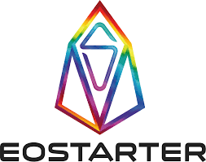

	

# EOS Token Sale Contract

    

EOStarter is developing a Token Sale Smart Contract system that allows for the crowd-sourcing of projects through a token sale that can be configured with different parameters like staking capabilities, whitelisting requirements, token vesting, etc.

You can read about the full specs of these  Smart Contracts here:

[TOKENSALE PLATFORM - SCOPE OF WORK](https://medium.com/eostarter/eostarter-tokensale-platform-scope-of-work-4cb153c33ab6)

# Project Description
These contracts are intended to support a decentralized Token Sale platform, which allows users to set up a token sale, determine the token sale parameters, and deploy their sale onto the EOS Mainnet.

The token sale platform is a decentralized application based on open-source smart contracts that any project can use to sell its tokens.

The Web Application repository these smart contracts are designed for can be found at the [EOS Token Sale Platform GitHub Repo](https://github.com/eostarter/eostarter.sale-smart-contract)

## Smart Contract Accounts 

The following eosio acconts have been created for smart contracts

### EOS Mainnet

#### [tokensaleapp](https://bloks.io/account/tokensaleapp)
#### [tokenpoolapp](https://bloks.io/account/tokensaleapp)

### Jungle3 testnet 

#### [tokensaleapp](https://jungle3.bloks.io/account/tokensaleapp)
#### [tokenpoolapp](https://jungle3.bloks.io/bloks.io/account/tokensaleapp)

# Contributing

Please Read EOS Costa Rica's [Open Source Contributing Guidelines](https://developers.eoscostarica.io/docs/open-source-guidelines).

Please report bugs big and small by [opening an issue](https://github.com/eostarter/eostarter.sale-smart-contract/issues)

# About EOSstarter

	

 

EOStarter is a Community-powered Incubator and Gamified Launchpad for EOS projects.

[eostarter.org](https://eostarter.org/)