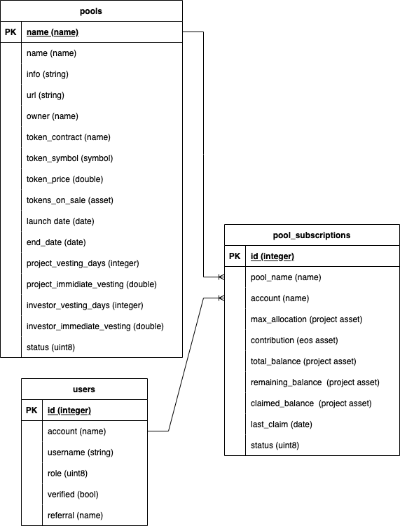

	

# EOS TokenSale Contract

    

EOStarter is developing a Token Sale Smart Contract system that allows for the crowd-sourcing of projects through a token sale that can be configured with different parameters like staking capabilities, whitelisting requirements, token vesting, etc.

You can read about the initial specs of the Smart Contract here:

[TOKENSALE PLATFORM - SCOPE OF WORK](https://medium.com/eostarter/eostarter-tokensale-platform-scope-of-work-4cb153c33ab6)

# Project Description
These contracts are intended to support a decentralized Token Sale platform, which allows users to set up a token sale, determine the token sale parameters, and deploy their sale onto the EOS Mainnet.

The token sale platform is a decentralized application based on an open-source smart contract that any project can use to sell its tokens.

The Web Application repository can be found at the [EOS Token Sale Platform GitHub Repo](https://github.com/eostarter/token-sale-platform)

## Situation and Approach

The system requires a project admin , users can can deploy their own token sale contract and assume the admin role or they can use the original contract managed by EOStarter.

Users must deploy and issue their own tokens , EOStater will not have access to token issuance or keys controlling project tokens.

### User Flow

#### User Roles
- Project Owner 
- Investor 
- Application Administrator

#### Project Owner
1. A token contract generator will provide project owners with a copy of the `eosio.token` contract .
1. Project owner deploys contract using an account they create and control.
1. Project owner creates and issues their project tokens.
1. Project Owner Creates a pool and sets parameters.
1. Application Admin reviews and approves pool.
1. Project Owner deposits token to smart contract.
1. Application Admin reviews and enables token sale.

#### Investor
1. Investor applies to participate in a project pool.
1. Application Admin reviews and whitelists investor account.
1. Investor agrees to terms.
1. Investor project purchases tokens with EOS.
1. Investor receives equivalent amount in project tokens.

## Data Model

	

## Smart Contract Actions 

| User Role | Action | Description | Pre-Conditions | Post-Conditions |
|---|---|---|---|---|
| App Admin  | adduser | add a new user | user must not be registered | user is registered  |
| App Admin  | edituser | edit an user | user must be registered  | user data is updated  |
| App Admin  | approvepool | approve a pool | pool must comply with requirements | pool is enabled  |
| App Admin  | rejectpool | reject a pool | pool must exist | pool is rejected  |
| App Admin  | startsale | start the token sale for a pool | launch_date and end_date must be valid | users can apply to pool  |
| App Admin  | endsale | end the token sale for a pool | launch_date and end_date must be valid | immediate vesting will be paid  |
| App Admin  | approvesubsc | approve a subscription | user and pool must comply with requirements | subscription is enabled  |
| App Admin  | rejectsubsc | reject a subscription | subscription must exist | subscription is rejected  |
|  |   |   |   |   |
| Project Owner | addpool | create a new pool | Account must exist and be verified | pool is pending approval
| Project Owner | token_contract:transfer | deposit project tokens to pool | pool must be approved | pool can be enabled | pool is funded |
| Project Owner | ownerclaim  | withdraw EOS tokens from pool | pool must have funds and vesting schedule met | project is funded |
|  |   |   |   |   |
| Investor | subscribe | Apply to a pool | Investor must be qualified and agree to terms | User is subscribed to a pool |
| Investor | eosio.token:transfer  | Contribute to a pool  | Pool must exist and user is verified | User can invest in a pool |
| Investor | investorclaim  | Claim project tokens from a pool | Account must have contributed | User no longer has tokens in pool |

## Smart Contract Accounts 

The following eosio acconts have been created for smart contracts

### EOS Mainnet

#### [tokensaleapp](https://bloks.io/account/tokensaleapp)
#### [tokenpoolapp](https://bloks.io/account/tokensaleapp)

### Jungle3 testnet 

#### [tokensaleapp](https://jungle3.bloks.io/account/tokensaleapp)
#### [tokenpoolapp](https://jungle3.bloks.io/bloks.io/account/tokensaleapp)

# Contributing

Please Read EOS Costa Rica's [Open Source Contributing Guidelines](https://developers.eoscostarica.io/docs/open-source-guidelines).

Please report bugs big and small by [opening an issue](https://github.com/eostarter/eostarter.sale-smart-contract/issues)

# About EOSTARTER

	

 

EOSTARTER is a Community-powered Incubator and Gamified Launchpad for EOSIO projects.

Visit us at: [eostarter.org](https://eostarter.org/)
